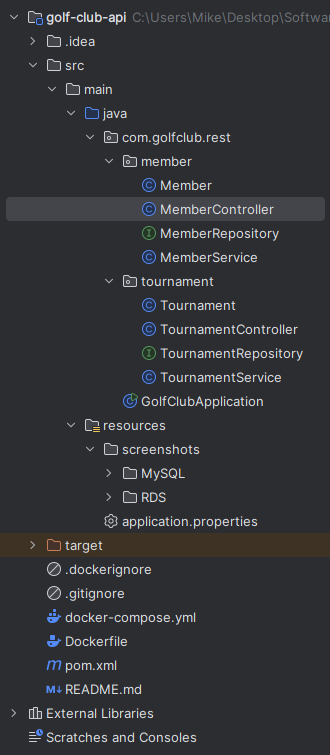

# Golf Club Management API

A RESTful API for managing golf club tournaments and memberships, built with Spring Boot, JPA/Hibernate, and MySQL. The application supports Docker deployment and AWS RDS integration.

## Table of Contents
- [Features](#features)
- [Technologies](#technologies)
- [Prerequisites](#prerequisites)
- [Running with Docker](#running-with-docker)
- [Running Locally](#running-locally)
- [API Endpoints](#api-endpoints)
- [AWS RDS Setup](#aws-rds-setup)
- [Testing with Postman](#testing-with-postman)
- [Peojct Structure](#project-structure)
- [Issues](#issues)

## Features

- **Member Management**: Create, read, update, and delete golf club members
- **Tournament Management**: Manage golf tournaments with entry fees and prize amounts
- **Member-Tournament Association**: Add/remove members to/from tournaments (many-to-many relationship)
- **Advanced Search**: Search members and tournaments by various criteria
- **Docker Support**: Easy deployment with Docker and Docker Compose
- **AWS RDS Integration**: Support for cloud database deployment

## Technologies

- **Java 17**
- **Spring Boot 3.2.0**
- **Spring Data JPA**
- **MySQL 8.0**
- **Maven**
- **Docker & Docker Compose**
- **AWS RDS** (for cloud deployment)

## Prerequisites

- Java 17 or higher
- Maven 3.6+
- Docker and Docker Compose
- **MySQL 8.0** (must be running locally for Docker setup)
- Postman

## Running with Docker

This setup assumes you have MySQL running locally on your machine.

### Prerequisites:

1. **Install and start MySQL locally**
   - Make sure MySQL is running on port 3306
   - Create the database:
     ```sql
     CREATE DATABASE golf_club_db;
     ```
   - Default credentials in docker-compose: root/password

### Steps:

1. **Clone the repository**
   ```bash
   git clone 
   cd golf-club-api
   ```

2. **Build the application with Maven**
   ```bash
   mvn clean package -DskipTests
   ```

3. **Build and run with Docker Compose**
   ```bash
   docker-compose up --build
   ```

   This will:
   - Build the Docker image from your JAR file
   - Start the Spring Boot application container
   - Connect to your local MySQL database
   - The API will be available at `http://localhost:8080`

4. **Stop the container**
   ```bash
   docker-compose down
   ```

### Docker Configuration Details:

- **Application Container**:
  - Port: 8080
  - Connects to MySQL on host machine using `host.docker.internal`
  - Database: golf_club_db
  - Username: root
  - Password: keyin54321

**Note**: The docker-compose.yml includes a commented-out RDS connection string for when you're ready to deploy to AWS.

## Running Locally

If you prefer to run without Docker:

1. **Install MySQL locally** and create a database:
   ```sql
   CREATE DATABASE golf_club_db;
   ```

2. **Update `application.properties`** with your MySQL credentials:
   ```properties
   spring.datasource.url=jdbc:mysql://localhost:3306/golf_club_db
   spring.datasource.username=your_username
   spring.datasource.password=your_password
   ```

3. **Build and run**:
   ```bash
   mvn clean install
   mvn spring-boot:run
   ```

## API Endpoints

### Member Endpoints

#### Create Member
- **POST** `/api/members`
- **Body**:
  ```json
  {
    "memberName": "Michael Barney",
    "memberAddress": "123 Main St, St. John's, NL",
    "memberEmail": "michaelbarney@example.com",
    "memberPhoneNumber": "709-555-1234",
    "startDate": "2025-09-15",
    "durationMonths": 12
  }
  ```

#### Get All Members
- **GET** `/api/members`

#### Get Member by ID
- **GET** `/api/members/{id}`

#### Update Member
- **PUT** `/api/members/{id}`
- **Body**: Same as Create Member

#### Delete Member
- **DELETE** `/api/members/{id}`

#### Search Members

- **Search by Name**: `GET /api/members/search/name?name=John`
- **Search by Phone**: `GET /api/members/search/phone?phoneNumber=709-555-1234`
- **Search by Start Date**: `GET /api/members/search/start-date?startDate=2024-01-15`
- **Search by Date Range**: `GET /api/members/search/date-range?startDate=2024-01-01&endDate=2024-12-31`
- **Get Members in Tournament**: `GET /api/members/search/tournament/{tournamentId}`

### Tournament Endpoints

#### Create Tournament
- **POST** `/api/tournaments`
- **Body**:
  ```json
  {
    "startDate": "2024-06-15",
    "endDate": "2024-06-17",
    "location": "St. John's Golf Club",
    "entryFee": 150.00,
    "cashPrizeAmount": 5000.00
  }
  ```

#### Get All Tournaments
- **GET** `/api/tournaments`

#### Get Tournament by ID
- **GET** `/api/tournaments/{id}`

#### Update Tournament
- **PUT** `/api/tournaments/{id}`
- **Body**: Same as Create Tournament

#### Delete Tournament
- **DELETE** `/api/tournaments/{id}`

#### Add Member to Tournament
- **POST** `/api/tournaments/{tournamentId}/members/{memberId}`

#### Remove Member from Tournament
- **DELETE** `/api/tournaments/{tournamentId}/members/{memberId}`

#### Get All Members in Tournament
- **GET** `/api/tournaments/{tournamentId}/members`

#### Search Tournaments

- **Search by Start Date**: `GET /api/tournaments/search/start-date?startDate=2024-06-15`
- **Search by Location**: `GET /api/tournaments/search/location?location=St. John's`
- **Search by Date Range**: `GET /api/tournaments/search/date-range?startDate=2024-06-01&endDate=2024-06-30`

## AWS RDS Setup

### Creating an RDS Instance

1. **Log in to AWS Console** and navigate to RDS

2. **Create Database**:
   - Engine: MySQL
   - Version: 8.0.x
   - Template: Free tier (for testing)
   - DB Instance Identifier: golf-club-db
   - Master username: admin
   - Master password: [your-secure-password]
   - DB instance class: db.t3.micro (or db.t2.micro for free tier)
   - Storage: 20 GB

3. **Configure Connectivity**:
   - VPC: Default VPC
   - Public access: Yes (for testing)
   - VPC security group: Create new or use existing
   - Availability Zone: No preference

4. **Additional Configuration**:
   - Initial database name: golf_club_db
   - Backup retention period: 7 days

5. **Create Database** and wait 5-10 mins for it to become available

### Connecting to RDS

Once your RDS instance is created, update the `application.properties` file:

Comment out your local setting and add the settings for your Rds

```properties
# AWS RDS Configuration
spring.datasource.url=jdbc:mysql://your-rds-endpoint.region.rds.amazonaws.com:3306/golf_club_db
spring.datasource.username=admin
spring.datasource.password=your-rds-password
spring.datasource.driver-class-name=com.mysql.cj.jdbc.Driver

# JPA Configuration
spring.jpa.hibernate.ddl-auto=update
spring.jpa.show-sql=true
```

### Security Group Configuration

Ensure your RDS security group allows inbound traffic:
- **Type**: MySQL/Aurora
- **Port**: 3306
- **Source**: 0.0.0.0/0 for testing

## Testing with Postman

### Import Postman Collection

1. Open Postman
2. Create a new collection called "Golf Club API"
3. Add the base URL variable: `http://localhost:8080`

### Example Tests

1. **Create a Member**:
   ```
   POST http://localhost:8080/api/members
   ```

2. **Create a Tournament**:
   ```
   POST http://localhost:8080/api/tournaments
   ```

3. **Add Member to Tournament**:
   ```
   POST http://localhost:8080/api/tournaments/1/members/1
   ```

4. **Search Members by Name**:
   ```
   GET http://localhost:8080/api/members/search/name?name=John
   ```

5. **Get All Members in Tournament**:
   ```
   GET http://localhost:8080/api/tournaments/1/members
   ```

### Expected Results

- All POST requests should return status 201 (Created)
- All GET requests should return status 200 (OK)
- All PUT requests should return status 200 (OK)
- All DELETE requests should return status 204 (No Content)
- All search endpoints should return arrays of matching entities

## Project Structure



## Issues

Only issue i ran into was creating my RDS database, I created it properly but when it deployed the name wasn't changed 
i had to delete the database and redeploy a new one with the proper name. Which took approx 20-25 extra minutes.
